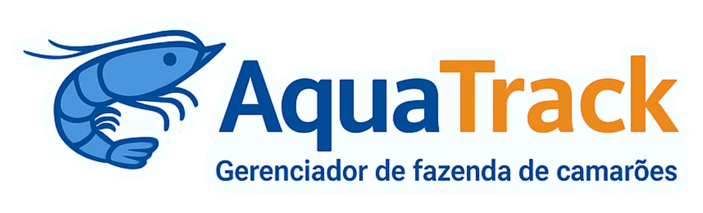

<p align="center">
<br>

</p>

## ⚠️ Versão antiga | Deprecated ⚠️

# 🦐 AquaTrack -- Gerenciador de Fazendas de Camarão


Sistema web para auxiliar proprietários e funcionários de fazendas aquícolas no **controle de dados, métricas e processos** relacionados ao cultivo de camarões.  
Permite monitorar **qualidade da água**, **gestão de ração** e **biometria dos camarões**, contribuindo para maior eficiência e sustentabilidade da produção.

---

## 📋 Sumário
- [🚀 Tecnologias Utilizadas](#-tecnologias-utilizadas)
- [🎯 Funcionalidades](#-funcionalidades)
- [📐 Arquitetura do Sistema](#-arquitetura-do-sistema)
- [⚙️ Instalação e Execução](#-instalação-e-execução)

---

## 🚀 Tecnologias Utilizadas
- **Linguagem:** Java
- **Framework Web:** [Javalin](https://javalin.io/)
- **Template Engine:** [Thymeleaf](https://www.thymeleaf.org/)
- **Arquitetura:** MVC (Model-View-Controller)
- **Gerenciamento de Dependências:** Maven
- **Persistência de Dados:** Arquivos JSON
- **Front-end:** HTML, CSS
- **Plataforma:** Servidor Web

---

## 🎯 Funcionalidades

### 1. Controle da Qualidade da Água
- Registro e consulta de parâmetros:
    - Amônia
    - Nitrito
    - pH
    - Alcalinidade
    - Salinidade
    - Oxigênio Dissolvido
- Histórico e análise comparativa dos dados _(Em desenvolvimento)_

### 2. Gestão de Ração
- Controle de estoque
- Registro do consumo diário _(Em desenvolvimento)_
- Atualização automática das quantidades disponíveis

### 3. Biometria dos Camarões
- Coleta de dados de crescimento (peso médio, amostragens)
- Estimativa de sobrevivência com base no consumo de ração _(Em desenvolvimento)_
- Cálculo automático do **FCA (Fator de Conversão Alimentar)** _(Em desenvolvimento)_

---

## 📐 Arquitetura do Sistema
O projeto segue o padrão **MVC**:

- **Model** → Representa os dados e regras de negócio (`src/main/java/model`)
- **View** → Interface web construída com HTML + Thymeleaf (`src/main/resources/templates`)
- **Controller** → Camada que recebe as requisições e coordena as respostas (`src/main/java/controller`)
- **Service** → Lógica e regras de negócio (`src/main/java/service`)
- **Repository** → Acesso e manipulação de dados (`src/main/java/repository`)

---

## ⚙️ Instalação e Execução

1. **Clonar o repositório**
```bash
git clone https://github.com/ufpb-aps-poo/projeto-grupo-04.git
```

2. **Acessar o diretório do projeto**
```bash
cd projeto-grupo-04
```

3. **Compilar e executar**
```bash
mvn clean install
mvn exec:java
```

4. **Acessar no navegador**
```
http://localhost:8000
```

---

💡 *Desenvolvido para ajudar fazendas de camarão a produzirem de forma mais eficiente e sustentável.*
